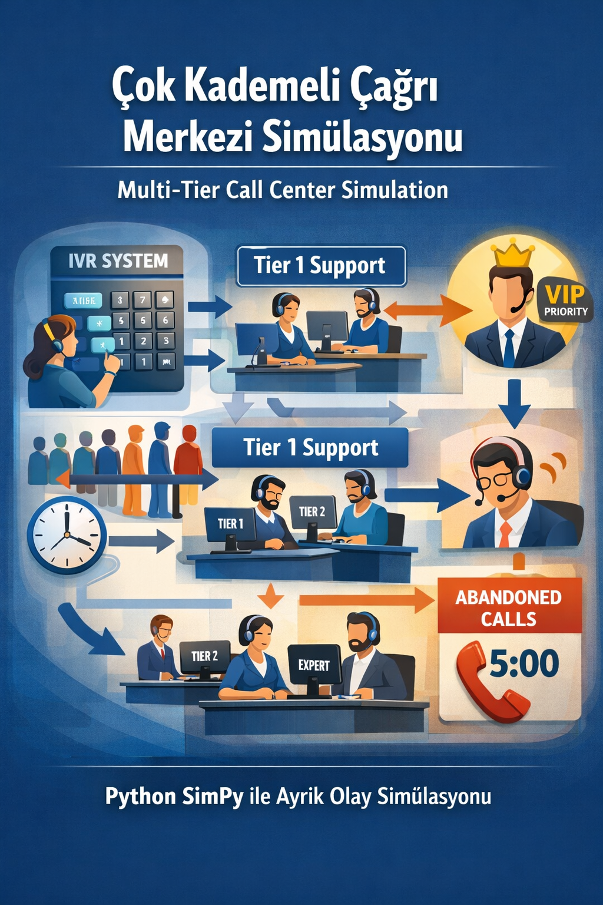
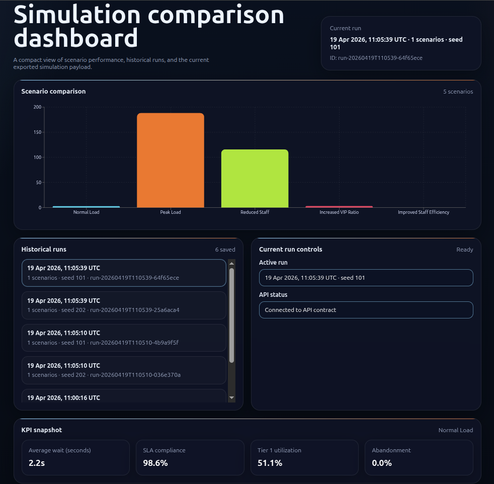
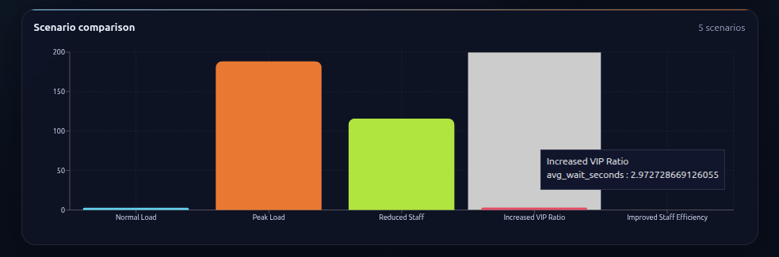
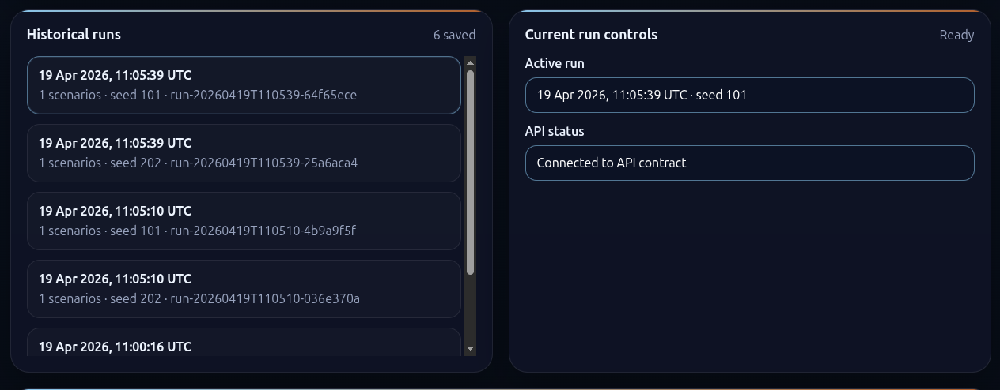
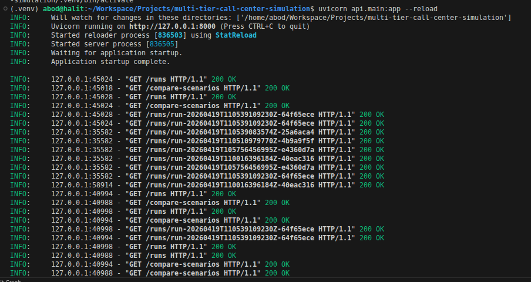
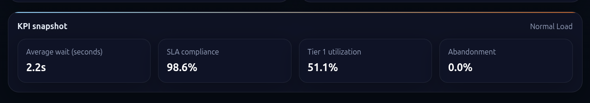

# Project Status Summary

## 1) General Concept, Purpose, and Problem

This project models a multi-tier call center (IVR, Tier 1, Tier 2, escalation flow) with a probabilistic discrete-event simulation.

The main purpose is to analyze how operational decisions affect performance under different scenarios, such as peak load, staffing changes, and VIP ratio changes.

The problem it solves is decision uncertainty in call center operations:

- How queue lengths and waiting times change under different loads
- How staffing and escalation policies impact service quality
- How to compare alternative scenarios with measurable KPIs before applying real-world changes

## 2) Tools and Technologies Used

- Python: core simulation logic
- SimPy: discrete-event simulation engine
- NumPy / Pandas: data processing and metrics aggregation
- FastAPI: API layer for exposing simulation outputs
- Uvicorn: ASGI server for API runtime
- React + TypeScript: dashboard UI
- Vite: frontend build and development tooling
- Recharts: data visualization for scenario comparison
- Zustand: frontend state management
- JSON Schema + OpenAPI: contract and API documentation
- unittest + jsonschema: validation and test coverage

## API Access in the Browser

Start the API with `uvicorn api.main:app --reload`, then open one of these URLs in the browser:

- Base URL: `http://127.0.0.1:8000`
- Health check: `http://127.0.0.1:8000/health`
- Swagger UI: `http://127.0.0.1:8000/docs`
- ReDoc: `http://127.0.0.1:8000/redoc`
- Example data endpoint: `http://127.0.0.1:8000/compare-scenarios`

## 3) Screenshots UI

### 3.1 Simulation Flow Overview

Shows the overall call-center simulation flow and system structure.

The flowchart image that explains the IVR, Tier 1, Tier 2, and escalation structure.

### 3.2 Dashboard Home

Shows the main UI entry and overall project view.

The top dashboard page after it loads, including the title, hero card, and main chart.

### 3.3 Scenario Comparison Chart

Shows side-by-side KPI comparison between simulation scenarios.

The colored bar chart section so the scenario names and bars are visible.

### 3.4 Saved Runs / History

Shows previously saved simulation runs and traceability.

The historical runs panel with multiple saved runs visible.

### 3.5 API Response Example

Shows real API output used by the dashboard (contract-aligned JSON).

The browser or API client showing a JSON response from `GET /compare-scenarios` or `GET /runs/{run_id}`.

### 3.6 KPI Snapshot

Shows the KPI cards with the most important performance values.

The KPI card section so average wait, SLA, utilization, and abandonment are visible.

## Main Shortcuts

- Full run instructions (data + simulation + API + UI): [assets/doc/run-steps.md](run-steps.md)
- Folder and file purpose guide: [assets/doc/project-structure.md](project-structure.md)
- UI presentation Q&A guide: [assets/doc/ui-presentation-guide.md](ui-presentation-guide.md)
- Short project overview: [README.md](../README.md)

